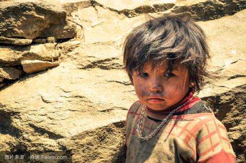

​	现实有时就是这么无情，其实很多人不是看不清现实，只是没有勇气面对现实。我们能做的是尽量珍惜拥有，加快强化自己。当残酷到来时我们多少能从容面对。在这个由钢筋铸造的城市中，我们被磨炼的不是变的无情，而是拥有钢铁般的心，更加强大而已。在这么明显的环境中，你还非要认为无论你处于什么处境，所有人格是平等。是应该可怜你、还是同情你？

​	有空任性却没空努力的人，那真是可怜之人必有可恨之处。

​	理论先于实践是因为想最大程度避免错的路，少撞墙。撞了不能再撞！

​	

​	想想自己多大了，不提是否应有能力回报，但是否连自己的选择的都不能承担。

​	自己选的路，就算跪着也要走完，宁可笑着流泪，也不要哭着后悔。