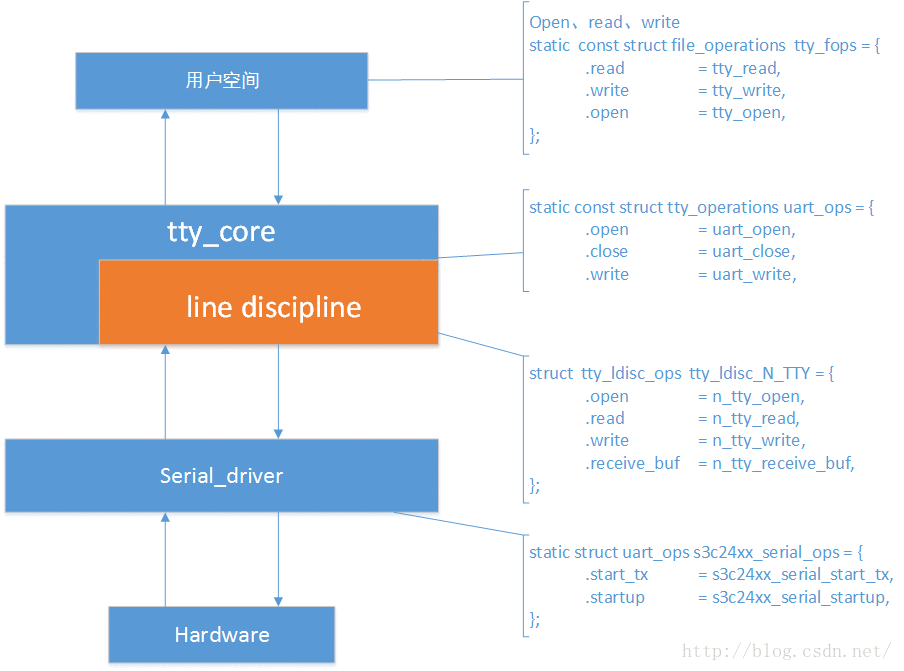

## 概览

### pppoe总框架原理


### pptp总框架原理


ppp可行性分析
------

### 本文介绍

​	现需要在我们自己公司的4G路由器上移植pptp功能. 4G路由器硬件为mips.本来只需把开源的pptp和pppd编译对应的mips版本即可.但是由于4G路由本身有一套ppp库代码.为了实现软件的优化和可控性,我们想把开源的pptp和我们系统已有的ppp库实现融合. 由于ppp库没有使用手册,并且想要修改pptp实现各种我们需要的定制功能,例:按需拨号,自动重连等功能.我们先需要分析ppp vpn框架原理和ppp代码实现.来完成我们的pptp项目软件设计.

### 难点

​	一 需要捋顺整个ppp相关框架也就是以上框架图,同时还要掌握框架中用到的内核关键结构体和index,应用用到的fd等.

​	二 需要掌握pppd的协议状态机.

### tty简介

首先需熟悉tty驱动框架,然后再分析ppp是如何结合tty框架实现的.

整个 uart 框架大概的样子如上图所示，简单来分的话可以说成两层，一层是下层我们的串口驱动层，它直接与硬件相接触，我们需要填充一个 struct uart_ops 的结构体，另一层是上层 tty 层，包括 tty 核心以及线路规程，它们各自都有一个 Ops 结构，用户空通过间是 tty 注册的字符设备节点来访问，这么说来如上图所示涉及到了4个 ops 结构了，层层跳转。。




### ppp内核态tty框架实现代码

ppp利用了tty中的规程层,实现了通过tty截获与发送数据.

在PPP驱动程序中, 

每一tty终端设备对应于一条PPP传输通道(channel), 

每一ppp网络设备对应于一个PPP接口单元(unit)

#### ppp内核态重要结构体

```c
struct channel{
	struct ppp /*包含struct ppp_file而ppp_file中包含index*/
	struct ppp_channel/*也包含struct channel*/
} /*generic定义*/

struct ppp {
	struct ppp_file	file;
}/*generic定义*/

struct ppp_file {
	int index;
}/*generic定义*/

struct asyncppp{
    struct ppp_channel/*包含struct channel找到index*/
}/*ppp_async定义 ppp_asynctty_open中初始化*/

ppp_asynctty_open初始化了
{
	struct asyncppp
	struct ppp_channel
	struct channel
	struct ppp_file
}
/*此函数很关键,要掌握如何调用此函数,也就更熟悉pppd初始化原理了*/
/*ppp_asynctty_open初始化了以上大部分结构体*/
/*调用此ppp_asynctty_open函数的位置比较隐蔽*/
/*是在pppd通过ioctl绑定规程时内核函数tty_set_ldisc中调用了此函数*/
/*以上结构体都初始化好后,pppd就可以通过/dev/ppp绑定channel_id了*/
```

#### pppd摘要代码框架

``` c
int main(argc, argv){
  	/*配置参数*/
  	...
    magic_init();
    /* Initialize each protocol.*/
    for (i = 0; (protp = protocols[i]) != NULL; ++i)
        (*protp->init)(0);
    /*创建虚拟接口*/
    ppp_available();
    for (i = 0; (protp = protocols[i]) != NULL; ++i)
        if (protp->check_options != NULL)
            (*protp->check_options)();
    if (the_channel->check_options)
        (*the_channel->check_options)();
  	/*进入状态机*/
	for (;;) {
  		lcp_open(0);		/* Start protocol */
  		start_link(0);
      	while (phase != PHASE_DEAD) {
        }
        lcp_close(0, "");
	}
}
```

#### ppp框架中的(tty用户层) 

``` c
//在tty_register_device中注册
```

#### ppp框架中的(tty核心层)

``` c
//在注册驱动层中注册的核心层  
1、为线路规程和termios分配空间，并使 tty_driver 相应的成员指向它们。
2、注册字符设备，名字是 uart_driver->name 我们这里是“ttySAC”,文件操作函数集是 tty_fops。
3、将该 uart_driver->tty_drivers 添加到全局链表 tty_drivers 。
4、向 proc 文件系统添加 driver ，这个暂时不了解。
int tty_register_driver(struct tty_driver *driver)  
{  
    tty_register_device(driver, i, NULL);  
    return 0;  
}  
```

#### ppp框架中的(tty规程层)  

``` c
ppp_async.c
static struct tty_ldisc_ops ppp_ldisc = {
	.owner  = THIS_MODULE,
	.magic	= TTY_LDISC_MAGIC,
	.name	= "ppp",
	.open	= ppp_asynctty_open,
	.close	= ppp_asynctty_close,
	.hangup	= ppp_asynctty_hangup,
	.read	= ppp_asynctty_read,
	.write	= ppp_asynctty_write,
	.ioctl	= ppp_asynctty_ioctl,
	.poll	= ppp_asynctty_poll,
	.receive_buf = ppp_asynctty_receive,
	.write_wakeup = ppp_asynctty_wakeup,
};

static int __init
ppp_async_init(void)
{
    /*注册tty规程*/
    err = tty_register_ldisc(N_PPP, &ppp_ldisc);
}

/*创建channel*/
static int ppp_asynctty_open(struct tty_struct *tty)
{

}

static int ppp_asynctty_ioctl(struct tty_struct *tty, struct file *file,
		   unsigned int cmd, unsigned long arg)
{
    switch (cmd) {
	case PPPIOCGCHAN:   //获取channel
    case PPPIOCGUNIT:   //
    case TCFLSH:
    case FIONREAD:
    }
}
```
#### ppp框架中的(tty驱动层)  

``` c
pty.c  
1、根据driver支持的最大设备数，申请n个 uart_state 空间，每一个 uart_state 都有一个 uart_port 。
2、分配一个 tty_driver ，并将drv->tty_driver 指向它。
3、对 tty_driver 进行设置，其中包括默认波特率、校验方式等，还有一个重要的 Ops ，uart_ops ，它是tty核心与我们串口驱动通信的接口。
4、初始化每一个 uart_state 的 tasklet 。
5、注册 tty_driver 。
pty_init()
{
	tty_set_operations(pty_driver, &pty_ops);
    tty_register_driver(pty_driver);
}
```

​	

```c
ppp_register_net_channel() {
	init_ppp_file(&pch->file, CHANNEL);
}
ppp_create_interface(){
	init_ppp_file(&ppp->file, INTERFACE);  
}
```

> ppp只需通过pptp知道一个tty_dev就可以了

### pppd配置参数

#### 	pppd相关fd

``` c
    /*/dev/pty/n 1.绑定规程 2.获取chindex 
    connect_tty中第二创建*/
	ppp_cfg[unit]->dev_fd = ppp_info->ttyfd; 

	/*/dev/ppp CHANNEL 
	pptp_setup_ppp中第三创建*/
    ppp_cfg[unit]->lcp_fd = fd;		

	/*/dev/ppp INTERFACE 
	make_ppp_unit中第一创建*/
    ppp_cfg[unit]->ppp_fd =  ppp_info->ppp_dev_fd; 
```

​	之所以列出此结构,是因为ppp启动状态机之前的所有初始化都和此配置相关.

​	我们初始化时可以利用此结构依次初始化.

#### 	pppd相关结构体

``` c
/*我们自己定义用于保存ppp配置*/
struct pptp_ppp_channel
{
    int ppp_dev_fd;	
    int ifunit;			/* Interface unit number */
    int ioctl_fd;			/*for ioctl*/
    struct thread *cdma_rth;
    struct thread *cdma_idle_tth;
    struct thread *at_rth;
    struct thread *at_tth;
    struct thread *auto_down_dial;
    list pkt_list;
    int ttyfd;
    int state;
    char user[256];	/* Username for authentication */
    char passwd[256];	/* Password for authentication */
    struct prefix_ipv4 local_addr;
    u8 	distance;
    u8 	weight;
    u8 	gateway;
    u8 	dns;
    int idle_time;
};
/*pppd状态机用到的结构体*/
struct ppp_info
{
	int unit;
	int dev_fd;
	int lcp_fd;
	int ppp_fd;
	int remote_id;
	char	*user;	/* Username for authentication */
	char	*passwd;	/* Password for authentication */
	char *ifname;
	char attach_inter[16];
	unsigned char distance;
	unsigned char weight;
	unsigned char gateway;
	unsigned char dns;
	unsigned char auth;
	unsigned char auth_type;
	unsigned char down_flag;	
	unsigned int unique;
	unsigned int dns_value;
	unsigned int wins_value;
	char usergrp[MAXNAMELEN];
	struct prefix_ipv4 localaddr;
	unsigned int peer_address;//tunnip
	int lcp_detect_interval_time;		
	int lcp_detect_lost_times;		
	struct thread * lcp_thread;
	struct thread * ipcp_rthread;
    void *conn;
    void *priv_data;
    int natid;
	int mtu;
	Ppp_if_type iftype;
	int (*manage_auto_down) (char *ifname);
	int (*ipcp_up_cb) (struct ppp_cb_info *cb_info);
	int (*ipcp_down_cb) (struct ppp_cb_info *cb_info);
    int (*lcp_auth) (char *name, char *group, char *password, unsigned char *challenge, int unit, int type);
    int (*check_rqci)(__u32 addr);
};
```


### pppd协议初始化原理代码

#### pppd对tty做规程绑定

```c
/* The PPP discpline */
static int ppp_disc = N_PPP;	

int tty_establish_ppp (int devfd)
{
    /*绑定tty规程*/
    if (ioctl(devfd, TIOCSETD, &ppp_disc) < 0)
    ret_fd = generic_establish_ppp(devfd);
}
```

#### pppd绑定对应pty_chindex	

``` c
//例
void start_link(unit)
{
	/*调用connect_tty*/
	devfd = the_channel->connect();
	/*调用tty_establish_ppp*/
	fd_ppp = the_channel->establish_ppp(devfd);
}

int connect_tty()
{
	/*char ppp_devnam[MAXPATHLEN]; //name of PPP tty*//
	get_pty(&pty_master, &pty_slave, ppp_devnam, uid);
    return pty_slave;
}

int tty_establish_ppp (int tty_fd)
{
	/*对tty做规程绑定*/
	if (ioctl(devfd, TIOCSETD, &ppp_disc) < 0)
    /*通过/dev/ppp设置channel*/
    ret_fd = generic_establish_ppp(tty_fd);
}
int generic_establish_ppp (int devfd)
{
	/*通过/dev/pty/n获取channel id*/
	if (ioctl(devfd, PPPIOCGCHAN, &chindex) == -1)
    /*打开"/dev/ppp"*/
    fd = open("/dev/ppp", O_RDWR)
    /*设置channel 到/dev/ppp*/
    if (ioctl(fd, PPPIOCATTCHAN, &chindex) < 0)
}
```
#### pppd协议发送接口初始化

```c
static int make_ppp_unit(struct cdma_ppp_channel *ppp_info)
{
	ppp_dev_fd = open("/dev/ppp", O_RDWR);
	x = ioctl(ppp_dev_fd, PPPIOCNEWUNIT, &req);
  	ppp_info->ppp_dev_fd = ppp_dev_fd;
}

int cdma_setup_ppp(struct cdma_ppp_channel *ppp_info)
{
  	fd = open("/dev/ppp", O_RDWR);
    if (ioctl(fd, PPPIOCATTCHAN, &chindex);
    if (ioctl(fd, PPPIOCCONNECT, &ppp_info->ifunit);
    
	ppp_cfg[unit]->dev_fd = ppp_info->ttyfd;
	ppp_cfg[unit]->lcp_fd = fd;
	ppp_cfg[unit]->ppp_fd = ppp_info->ppp_dev_fd;
}

void output (int unit, unsigned char *p, int len)
{
  int fd = ppp_cfg[unit]->lcp_fd;
  
  if (ppp_cfg[unit]->ppp_fd >= 0 && !(proto >= 0xc000 || proto == PPP_CCPFRAG))
		fd = ppp_cfg[unit]->ppp_fd;
  
  if (write(fd, p, len) < 0)
}
```

### pppd协议/转状态机原理

#### pppd状态机框图


####  pppd状态机启动代码

```c
int cdma_setup_ppp(struct cdma_ppp_channel *ppp_info){
	magic_init();
	for (i = 0; (protp = protocols[i]) != NULL; ++i)
		(*protp->init)(unit);
	new_phase(unit,PHASE_ESTABLISH);
	lcp_lowerup(unit);
	lcp_open(unit);		/* Start protocol */
	ppp_cfg[unit]->lcp_thread = thread_add_read(master, pppd_read, (void *)unit, fd);
	ppp_cfg[unit]->ipcp_rthread = thread_add_read(master, pppd_read, (void *)unit,  ppp_info->ppp_dev_fd);
}
```


#### pppd协议发包流程

```c
//ppp_generic.c
//ppp_xmit_process 通过虚拟网口
//ppp_channel_push 通过tty

switch (cmd) {
case PPPIOCNEWUNIT:
ppp = ppp_create_interface(net, unit, &err);
file->private_data = &ppp->file;
}
ppp_write(){
struct ppp_file *pf = file->private_data;
switch (pf->kind) {
case INTERFACE:
	ppp_xmit_process(PF_TO_PPP(pf));
	break;
case CHANNEL:
	ppp_channel_push(PF_TO_CHANNEL(pf));
	break;
}
```

#### 虚拟网口发包流程

```
ppp_start_xmit->ppp_xmit_process->
ppp_push调用pch->chan->ops->start_xmit发送数据包。    
ppp_asynctty_open中注册的ppp_async_send函数，	
---规程层---
ppp_async_send经ppp_async_push函数调用
tty->driver->write把数据发送串口
---驱动层---
pty_ops
```

例如:tty->driver->write为pty_ops中的write   

```c
//注:其中pty-master可以理解为tty硬件层
//内核中pty.c 设置驱动层操作函数
pty_init()
{
	tty_set_operations(pty_driver, &pty_ops);
}
//pppd为以上pty和disc做了绑定
//也就是驱动层到规程层关联
int tty_establish_ppp (int devfd)
{
    /*绑定tty规程*/
    if (ioctl(devfd, TIOCSETD, &ppp_disc) < 0)
    ret_fd = generic_establish_ppp(devfd);
}
//其中channel_id为以上操作标识
```


#### ppp_channel_push(PF_TO_CHANNEL(pf))

```
		ppp = ppp_create_interface(net, unit, &err);
		if (!ppp)
			break;
		file->private_data = &ppp->file;
```


#### ppp_xmit_process(PF_TO_PPP(pf))

```
		ppp = ppp_create_interface(net, unit, &err);
		if (!ppp)
			break;
		file->private_data = &ppp->file;

```


ppp_设置网口ip


pptp原理与设计
------

值得一提的是 ppp的LCP协商Configure-Request,是在pptp中发的.

``` c
数据结构:
pptp_cfg
{
	int instance_id;
    int gre_fd;
	int tty_fd;
    int call_id;
    int peer_call_id;
    char username[];
    char password[];
}
操作函数:
启动
1. 创建gre_fd
2. 创建tty_fd;
3. 通过pptp协商获取call_id
4. 启动gre_copy线程
5. 执行ppp协商,创建虚拟接口
关闭
1. 协商断开ppp连接, 协商断开pptp连接.
2. 关闭虚拟接口
2. gre_copy通过pptp_cfg标记退出线程并释放对应pptp_cfg
```


## PPTP模块简易软件设计

1. 改造PPTP
2. 初始化PPPD相关设置
3. 启动PPPD状态机


## PPTP软件设计方案


### 多实例原理与设计

考虑多实例, 可以把每个实例运行一个线程. 

1. 多线程问题,就要考虑:  
   **全局变量** **互斥条件** **执行顺序** **信号** 等.  
   pptp 本身是多进程实现多个连接,  
   所以想要多线程实现多个连接, 还需解决变量问题.  

2. 也可以用多进程实现多实例  
   但是又要考虑控制进程时,需要进程间通信.  

3. 多进程合并为线程和合并pppd需要考虑信号, 输入输出等问题.


pptp 完成二层点对点通道
ppp 完成三层ip通道

一. 完成pppd和pptp的整合, 使pptp可以和pppd.a编译在一起运行.  

```
	1.分析pppd原理.  
		包含:pppd 利用/dev/ppp0字符设备,通过内核到pptp_gre. 
        这需要分析内核的实现.  
	2.分析pptp原理.
```

二. 完成pptp初始化和二层点对点环境的建立.

三. 完成cli的demon融合

接口描述：

	pptp_init	: 1.初始化pptp默认参数 2.开启ctrl
	pptp_set 	: 1.设置定制参数 
	pptp_enable : 1. Ctrl连接, Gre隧道建立, 获取call_id
				  2. 开启ppp任务, 开启copy功能任务
	pptp_disable: 1. 关闭ppp任务, 关闭copy功能 

```
1. Ctrl连接, Gre隧道断开任务
     pppd通过字符设备/dev/ppp 和内核通信和发送协商报文
```
通过以上字符设备实现,发现ppp内核字符设备就一个.
如果要多个要注册多个ppp字符设备.
并且发送协商报文出口是在字符设备的私有数据段中.

pppd主要完成功能:
1.链路协商
2.创建虚拟接口

链路协商需要提供:

创建虚拟接口提供:

pppd输入: 1.pptp参数 2.pptp协商后信息
pppd输出: 1.设置虚拟接口

1. 其中启动ppp任务,pptp需要传入tty_fd相关信息

pppd接口 

1. l2tp_setup_pppd
2. establlish_session

pppd所有配置参数

```c
typedef struct {
	char	*name;		/* name of the option */
	enum opt_type type;
	void	*addr;
	char	*description;
	unsigned int flags;
	void	*addr2;
	int	upper_limit;
	int	lower_limit;
	const char *source;
	short int priority;
	short int winner;
} option_t;
```

pppd中的ppp_main.c 
中的main函数改为ppp_setup只是避免main冲突和做参考,并没有用.

真正的pppd启动函数在l2tp中模仿之前的main函数改为l2pd_pppox.c中**l2tp_setup_pppd**

l2tp_peer 是用来和对端通信的接口

ppp_ioctl  配置了ppp_channel *chan
ppp_write  

移植
l2tp_ppp(sync_pppd) -> pptp_ppp
l2tp_pppox -> pptp_pppox   

### 命令行原理与设计

如果需要多实例,则全局pptp配置连接 pptp守护进程.

守护进程只负责创建实例删除实例.


### 实现方案

#### 第一阶段: 开源验证

​	实现pptp, pppd分离启动  
​	/*唯一需要修改的是pptp在pty_read地方,   
​	发现pppd为启动则continue*/
​	pptp 和pppd 开源独立测试
​	./pptp 192.168.2.12
​	./pppd /dev/pts/2 unit 1 user test@hfdzzp.vpdn.zj password test135

#### 第二阶段: 简单demo

​	实现pptp融合我们系统中的pppd库
​	/*实现简单的demo, 只是能ping通即可*/
​	/*在测试中发现 必须以协议的方式下发ip,
​	不能以以下方式设置,还不知道有何区别*/
​	ifconfig pptp0 up
​	ifconfig pptp0 192.168.210.10   //此方法配置ip不可行 必须以api的方式配置
​	route add -net 192.168.210.0 netmask 255.255.255.0 pptp0

#### 第三阶段: 设计方案

​	继续分析ppp相关代码,实现优化方案

​	多实例?

#### 第四阶段: 实现代码

#### 第五阶段: 测试功能 


## 还未掌握内容

1. unit /channel_id / struct ppp /struct ppp_file 等千丝万缕的关系.


pppd初始化流程start_link

第一步: 通过connect_tty拿到pty_client_fd

第二步: 通过tty_establish_ppp做规程绑定


callmgr_main->pptp_dispatch->pptp_handle_timer


断开后 应该退出pptp_ctrl进程 和 ppp线程

断开重连 应该再次pptp协商 和ppp协商


## 参考:

​	[tty初探—uart驱动框架分析](http://blog.csdn.net/lizuobin2/article/details/51773305)

​	[Linux PPP详细介绍](http://blog.csdn.net/wt0427/article/details/7761163)

​	[Linux PPP 数据收发流程](http://linux.chinaunix.net/techdoc/system/2008/11/07/1043935.shtml)

